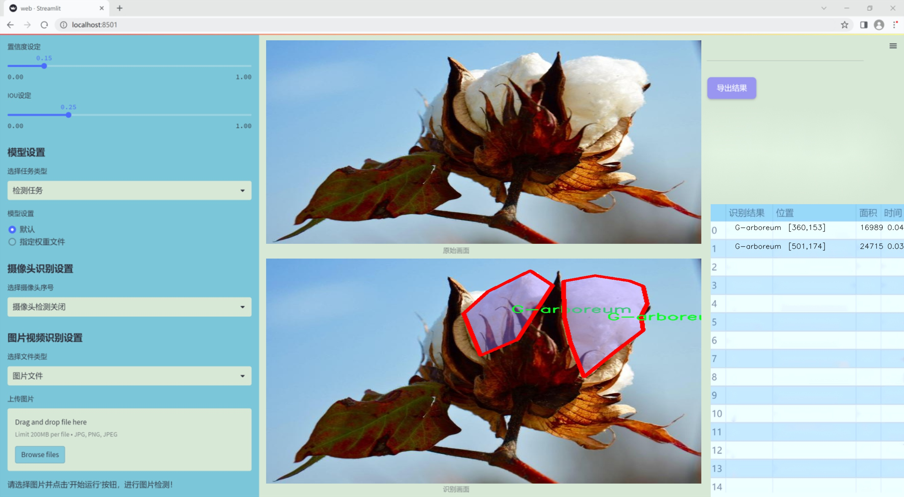
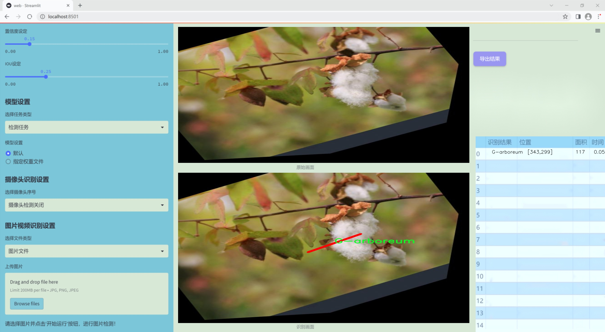
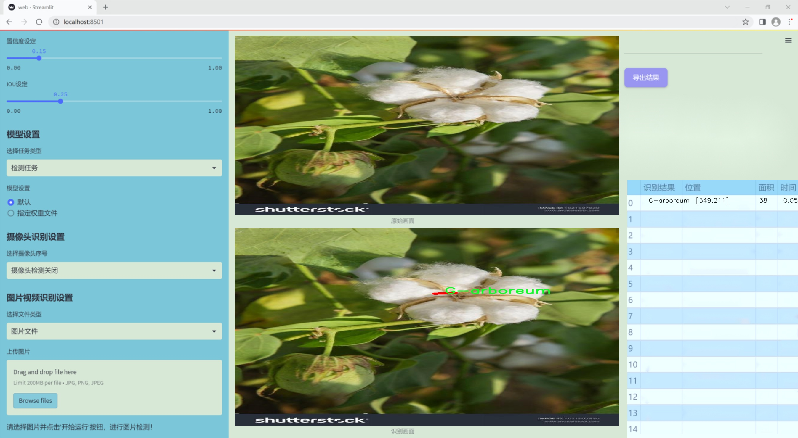
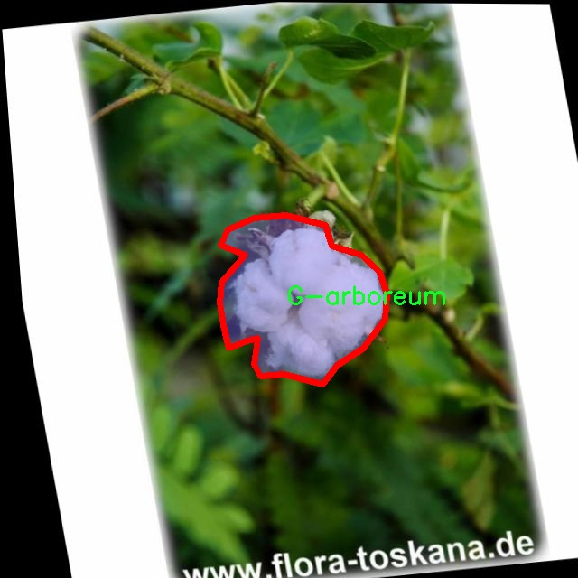
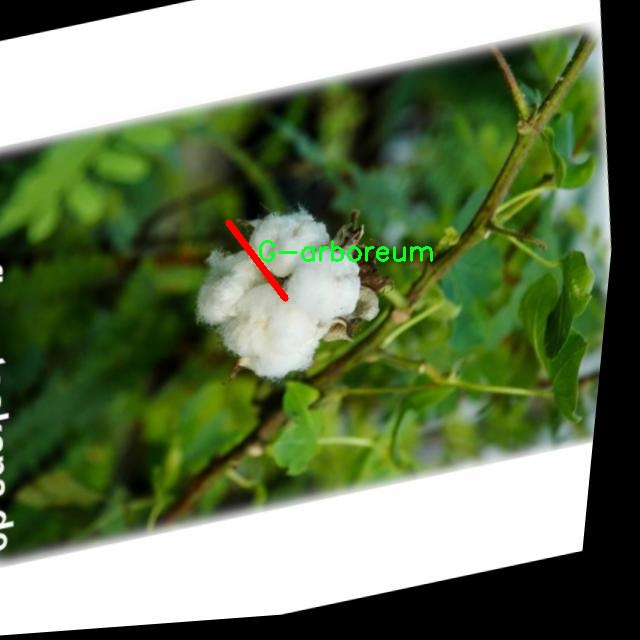
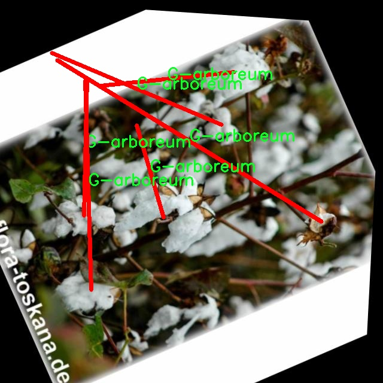
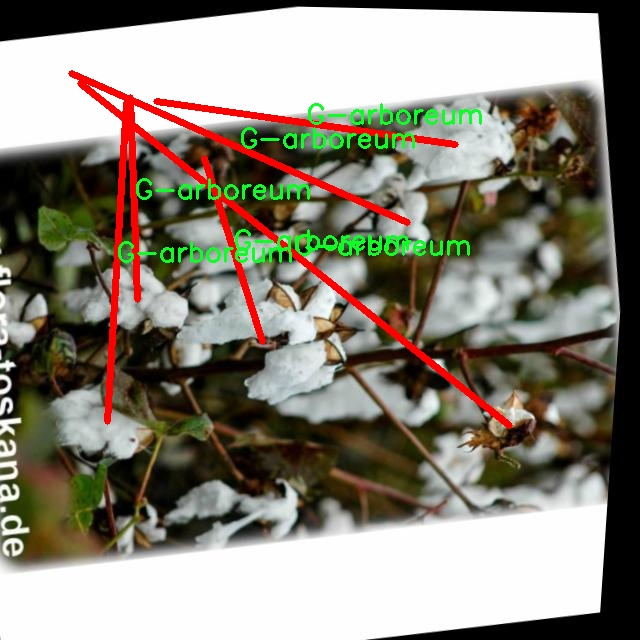
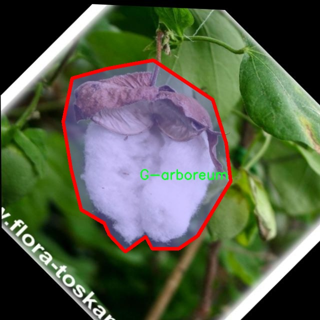

### 1.背景意义

研究背景与意义

棉花作为全球重要的经济作物之一，广泛应用于纺织、医药和食品等多个领域。随着全球对棉花需求的不断增加，如何高效、准确地识别和分类不同品种的棉花，成为了农业生产和研究中的一项重要任务。传统的棉花品种识别方法往往依赖于人工观察和经验判断，这不仅耗时耗力，而且容易受到主观因素的影响，导致识别结果的不准确。因此，基于计算机视觉的自动化识别技术逐渐成为研究的热点。

近年来，深度学习技术的迅猛发展为图像识别提供了新的解决方案。其中，YOLO（You Only Look Once）系列算法因其高效的实时检测能力而受到广泛关注。YOLOv11作为该系列的最新版本，结合了多种先进的特征提取和图像处理技术，具备了更强的检测精度和速度。然而，针对棉花品种的具体应用，现有的YOLO模型仍需进行改进，以适应棉花图像的特征和复杂背景。

本研究旨在基于改进的YOLOv11算法，构建一个高效的棉花品种识别图像分割系统。我们使用了包含1684张图像的棉花数据集，涵盖了四种主要棉花品种：G-arboreum、G-barbadense、G-herbaceum和G-hirsitum。该数据集经过精心标注和预处理，采用了多种数据增强技术，以提高模型的泛化能力和鲁棒性。通过对图像进行旋转、剪切等处理，我们希望提升模型在实际应用中的表现。

本研究不仅有助于提高棉花品种的识别效率，还将为农业智能化发展提供重要的技术支持。通过自动化的识别系统，农民和研究人员能够更快速地获取棉花品种信息，从而优化种植策略和提高产量，推动可持续农业的发展。因此，基于改进YOLOv11的棉花品种识别图像分割系统的研究具有重要的理论意义和实际应用价值。

### 2.视频效果

[2.1 视频效果](https://www.bilibili.com/video/BV1ozU3YdE1a/)

### 3.图片效果







##### [项目涉及的源码数据来源链接](https://kdocs.cn/l/cszuIiCKVNis)**

注意：本项目提供训练的数据集和训练教程,由于版本持续更新,暂不提供权重文件（best.pt）,请按照6.训练教程进行训练后实现上图演示的效果。

### 4.数据集信息

##### 4.1 本项目数据集类别数＆类别名

nc: 4
names: ['G-arboreum', 'G-barbadense', 'G-herbaceum', 'G-hirsitum']


该项目为【图像分割】数据集，请在【训练教程和Web端加载模型教程（第三步）】这一步的时候按照【图像分割】部分的教程来训练

##### 4.2 本项目数据集信息介绍

本项目数据集信息介绍

本项目所使用的数据集旨在支持改进YOLOv11模型在棉花品种识别图像分割系统中的应用，专注于棉花的检测与分类。数据集的主题为“Cotton-Detection”，涵盖了四种主要的棉花品种，分别为G-arboreum、G-barbadense、G-herbaceum和G-hirsitum。这些品种不仅在形态特征上存在显著差异，而且在生长环境、产量和纤维质量等方面也具有各自的独特性，因此对其进行准确的识别和分类具有重要的农业和经济意义。

数据集中的图像经过精心挑选和标注，确保涵盖了不同生长阶段、不同光照条件和不同背景下的棉花样本，以增强模型的泛化能力和鲁棒性。每个类别的样本数量均衡，力求在训练过程中避免类别不平衡带来的偏差，从而提高模型在实际应用中的识别准确率。此外，数据集还包含了多种拍摄角度和视角，以模拟真实环境中可能遇到的各种情况。

通过使用这一数据集，研究团队希望能够训练出一个高效的图像分割系统，不仅能够准确识别出不同棉花品种的特征，还能在复杂背景中进行有效分割。这将为棉花的精准农业管理提供强有力的技术支持，帮助农民更好地进行品种选择和田间管理，最终实现农业生产的智能化和高效化。通过不断优化YOLOv11模型，期望在棉花品种识别领域取得突破性进展，为相关研究和应用提供重要的数据支撑和理论依据。











### 5.全套项目环境部署视频教程（零基础手把手教学）

[5.1 所需软件PyCharm和Anaconda安装教程（第一步）](https://www.bilibili.com/video/BV1BoC1YCEKi/?spm_id_from=333.999.0.0&vd_source=bc9aec86d164b67a7004b996143742dc)


[5.2 安装Python虚拟环境创建和依赖库安装视频教程（第二步）](https://www.bilibili.com/video/BV1ZoC1YCEBw?spm_id_from=333.788.videopod.sections&vd_source=bc9aec86d164b67a7004b996143742dc)

### 6.改进YOLOv11训练教程和Web_UI前端加载模型教程（零基础手把手教学）

[6.1 改进YOLOv11训练教程和Web_UI前端加载模型教程（第三步）](https://www.bilibili.com/video/BV1BoC1YCEhR?spm_id_from=333.788.videopod.sections&vd_source=bc9aec86d164b67a7004b996143742dc)


按照上面的训练视频教程链接加载项目提供的数据集，运行train.py即可开始训练



     Epoch   gpu_mem       box       obj       cls    labels  img_size
     1/200     20.8G   0.01576   0.01955  0.007536        22      1280: 100%|██████████| 849/849 [14:42<00:00,  1.04s/it]
               Class     Images     Labels          P          R     mAP@.5 mAP@.5:.95: 100%|██████████| 213/213 [01:14<00:00,  2.87it/s]
                 all       3395      17314      0.994      0.957      0.0957      0.0843

     Epoch   gpu_mem       box       obj       cls    labels  img_size
     2/200     20.8G   0.01578   0.01923  0.007006        22      1280: 100%|██████████| 849/849 [14:44<00:00,  1.04s/it]
               Class     Images     Labels          P          R     mAP@.5 mAP@.5:.95: 100%|██████████| 213/213 [01:12<00:00,  2.95it/s]
                 all       3395      17314      0.996      0.956      0.0957      0.0845

     Epoch   gpu_mem       box       obj       cls    labels  img_size
     3/200     20.8G   0.01561    0.0191  0.006895        27      1280: 100%|██████████| 849/849 [10:56<00:00,  1.29it/s]
               Class     Images     Labels          P          R     mAP@.5 mAP@.5:.95: 100%|███████   | 187/213 [00:52<00:00,  4.04it/s]
                 all       3395      17314      0.996      0.957      0.0957      0.0845


###### [项目数据集下载链接](https://kdocs.cn/l/cszuIiCKVNis)

### 7.原始YOLOv11算法讲解


###### YOLOv11改进方向

与YOLOv 10相比，YOLOv 11有了巨大的改进，包括但不限于：

  * 增强的模型结构：模型具有改进的模型结构，以获取图像处理并形成预测
  * GPU优化：这是现代ML模型的反映，GPU训练ML模型在速度和准确性上都更好。
  * 速度：YOLOv 11模型现在经过增强和GPU优化以用于训练。通过优化，这些模型比它们的前版本快得多。在速度上达到了25%的延迟减少！
  * 更少的参数：更少的参数允许更快的模型，但v11的准确性不受影响
  * 更具适应性：更多支持的任务YOLOv 11支持多种类型的任务、多种类型的对象和多种类型的图像。

###### YOLOv11功能介绍

Glenn Jocher和他的团队制作了一个令人敬畏的YOLOv 11迭代，并且在图像人工智能的各个方面都提供了YOLO。YOLOv 11有多种型号，包括：

  * 对象检测-在训练时检测图像中的对象
  * 图像分割-超越对象检测，分割出图像中的对象
  * 姿态检测-当用点和线训练时绘制一个人的姿势
  * 定向检测（OBB）：类似于对象检测，但包围盒可以旋转
  * 图像分类-在训练时对图像进行分类

使用Ultralytics Library，这些模型还可以进行优化，以：

  * 跟踪-可以跟踪对象的路径
  * 易于导出-库可以以不同的格式和目的导出
  * 多场景-您可以针对不同的对象和图像训练模型

此外，Ultralytics还推出了YOLOv 11的企业模型，该模型将于10月31日发布。这将与开源的YOLOv
11模型并行，但将拥有更大的专有Ultralytics数据集。YOLOv 11是“建立在过去的成功”的其他版本的之上。

###### YOLOv11模型介绍

YOLOv 11附带了边界框模型（无后缀），实例分割（-seg），姿态估计（-pose），定向边界框（-obb）和分类（-cls）。

这些也有不同的尺寸：纳米（n），小（s），中（m），大（l），超大（x）。


YOLOv11模型

###### YOLOv11与前版本对比

与YOLOv10和YOLOv8相比，YOLOv11在Ultralytics的任何帖子中都没有直接提到。所以我会收集所有的数据来比较它们。感谢Ultralytics：

**检测：**


YOLOv11检测统计


YOLOv10检测统计

其中，Nano的mAPval在v11上为39.5，v10上为38.5；Small为47.0 vs 46.3，Medium为51.5 vs
51.1，Large为53.4 vs 53.2，Extra Large为54.7vs
54.4。现在，这可能看起来像是一种增量增加，但小小数的增加可能会对ML模型产生很大影响。总体而言，YOLOv11以0.3
mAPval的优势追平或击败YOLOv10。

现在，我们必须看看速度。在延迟方面，Nano在v11上为1.55 , v10上为1.84，Small为2.46 v2.49，Medium为4.70
v4.74，Large为6.16 v7.28，Extra Large为11.31
v10.70。延迟越低越好。YOLOv11提供了一个非常低的延迟相比，除了特大做得相当差的前身。

总的来说，Nano模型是令人振奋的，速度更快，性能相当。Extra Large在性能上有很好的提升，但它的延迟非常糟糕。

**分割：**


YOLOV11 分割统计


YOLOV9 分割统计


YOLOV8 分割数据

总体而言，YOLOv 11上的分割模型在大型和超大型模型方面比上一代YOLOv 8和YOLOv 9做得更好。

YOLOv 9 Segmentation没有提供任何关于延迟的统计数据。比较YOLOv 11延迟和YOLOv 8延迟，发现YOLOv 11比YOLOv
8快得多。YOLOv 11将大量GPU集成到他们的模型中，因此期望他们的模型甚至比CPU测试的基准更快！

姿态估计：


YOLOV11姿态估计统计


YOLOV8姿态估计统计

YOLOv 11的mAP 50 -95统计量也逐渐优于先前的YOLOv 8（除大型外）。然而，在速度方面，YOLOv
11姿势可以最大限度地减少延迟。其中一些延迟指标是版本的1/4！通过对这些模型进行GPU训练优化，我可以看到指标比显示的要好得多。

**定向边界框：**


YOLOv11 OBB统计


YOLOv8 OBB统计

OBB统计数据在mAP
50上并不是很好，只有非常小的改进，在某种程度上小于检测中的微小改进。然而，从v8到v11的速度减半，这表明YOLOv11在速度上做了很多努力。

**最后，分类：**


YOLOv 11 CLS统计


YOLOv8 CLS统计

从v8到v11，准确性也有了微小的提高。然而，速度大幅上升，CPU速度更快的型号。


### 8.200+种全套改进YOLOV11创新点原理讲解

#### 8.1 200+种全套改进YOLOV11创新点原理讲解大全

由于篇幅限制，每个创新点的具体原理讲解就不全部展开，具体见下列网址中的改进模块对应项目的技术原理博客网址【Blog】（创新点均为模块化搭建，原理适配YOLOv5~YOLOv11等各种版本）

[改进模块技术原理博客【Blog】网址链接](https://gitee.com/qunmasj/good)


#### 8.2 精选部分改进YOLOV11创新点原理讲解

###### 这里节选部分改进创新点展开原理讲解(完整的改进原理见上图和[改进模块技术原理博客链接](https://gitee.com/qunmasj/good)【如果此小节的图加载失败可以通过CSDN或者Github搜索该博客的标题访问原始博客，原始博客图片显示正常】

### RT-DETR骨干网络HGNetv2简介
#### RT-DETR横空出世
前几天被百度的RT-DETR刷屏，参考该博客提出的目标检测新范式对原始DETR的网络结构进行了调整和优化，以提高计算速度和减小模型大小。这包括使用更轻量级的基础网络和调整Transformer结构。并且，摒弃了nms处理的detr结构与传统的物体检测方法相比，不仅训练是端到端的，检测也能端到端，这意味着整个网络在训练过程中一起进行优化，推理过程不需要昂贵的后处理代价，这有助于提高模型的泛化能力和性能。


当然，人们对RT-DETR之所以产生浓厚的兴趣，我觉得大概率还是对YOLO系列审美疲劳了，就算是出到了YOLO10086，我还是只想用YOLOv11和YOLOv11的框架来魔改做业务。。

#### 初识HGNet
看到RT-DETR的性能指标，发现指标最好的两个模型backbone都是用的HGNetv2，毫无疑问，和当时的picodet一样，骨干都是使用百度自家的网络。初识HGNet的时候，当时是参加了第四届百度网盘图像处理大赛，文档图像方向识别专题赛道，简单来说，就是使用分类网络对一些文档截图或者图片进行方向角度分类。


当时的方案并没有那么快定型，通常是打榜过程发现哪个网络性能好就使用哪个网络做魔改，而且木有显卡，只能蹭Ai Studio的平台，不过v100一天8小时的实验时间有点短，这也注定了大模型用不了。 

流水的模型，铁打的炼丹人，最后发现HGNet-tiny各方面指标都很符合我们的预期，后面就一直围绕它魔改。当然，比赛打榜是目的，学习才是享受过程，当时看到效果还可以，便开始折腾起了HGNet的网络架构，我们可以看到，PP-HGNet 针对 GPU 设备，对目前 GPU 友好的网络做了分析和归纳，尽可能多的使用 3x3 标准卷积（计算密度最高），PP-HGNet是由多个HG-Block组成，细节如下：


ConvBNAct是啥？简单聊一聊，就是Conv+BN+Act，CV Man应该最熟悉不过了：
```python
class ConvBNAct(TheseusLayer):
    def __init__(self,
                 in_channels,
                 out_channels,
                 kernel_size,
                 stride,
                 groups=1,
                 use_act=True):
        super().__init__()
        self.use_act = use_act
        self.conv = Conv2D(
            in_channels,
            out_channels,
            kernel_size,
            stride,
            padding=(kernel_size - 1) // 2,
            groups=groups,
            bias_attr=False)
        self.bn = BatchNorm2D(
            out_channels,
            weight_attr=ParamAttr(regularizer=L2Decay(0.0)),
            bias_attr=ParamAttr(regularizer=L2Decay(0.0)))
        if self.use_act:
            self.act = ReLU()
 
    def forward(self, x):
        x = self.conv(x)
        x = self.bn(x)
        if self.use_act:
            x = self.act(x)
        return x 
```
且标准卷积的数量随层数深度增加而增多，从而得到一个有利于 GPU 推理的骨干网络，同样速度下，精度也超越其他 CNN ，性价比也优于ViT-base模型。


另外，我们可以看到：

PP-HGNet 的第一层由channel为96的Stem模块构成，目的是为了减少参数量和计算量。PP-HGNet

Tiny的整体结构由四个HG Stage构成，而每个HG Stage主要由包含大量标准卷积的HG Block构成。

PP-HGNet的第三到第五层使用了使用了可学习的下采样层（LDS Layer），该层group为输入通道数，可达到降参降计算量的作用，且Tiny模型仅包含三个LDS Layer，并不会对GPU的利用率造成较大影响.

PP-HGNet的激活函数为Relu，常数级操作可保证该模型在硬件上的推理速度。

### 9.系统功能展示

图9.1.系统支持检测结果表格显示

  图9.2.系统支持置信度和IOU阈值手动调节

  图9.3.系统支持自定义加载权重文件best.pt(需要你通过步骤5中训练获得)

  图9.4.系统支持摄像头实时识别

  图9.5.系统支持图片识别

  图9.6.系统支持视频识别

  图9.7.系统支持识别结果文件自动保存

  图9.8.系统支持Excel导出检测结果数据


### 10. YOLOv11核心改进源码讲解

#### 10.1 transformer.py

以下是对给定代码的核心部分进行提炼和详细注释的结果：

```python
import torch
import torch.nn as nn
from functools import partial

from .prepbn import RepBN, LinearNorm
from ..modules.transformer import TransformerEncoderLayer

# 定义全局变量，使用 LayerNorm 和 RepBN 进行线性归一化
ln = nn.LayerNorm
linearnorm = partial(LinearNorm, norm1=ln, norm2=RepBN, step=60000)

class TransformerEncoderLayer_RepBN(TransformerEncoderLayer):
    def __init__(self, c1, cm=2048, num_heads=8, dropout=0, act=..., normalize_before=False):
        # 初始化父类 TransformerEncoderLayer
        super().__init__(c1, cm, num_heads, dropout, act, normalize_before)
        
        # 使用线性归一化和 RepBN 进行层归一化
        self.norm1 = linearnorm(c1)
        self.norm2 = linearnorm(c1)

class AIFI_RepBN(TransformerEncoderLayer_RepBN):
    """定义 AIFI transformer 层。"""

    def __init__(self, c1, cm=2048, num_heads=8, dropout=0, act=nn.GELU(), normalize_before=False):
        """使用指定参数初始化 AIFI 实例。"""
        super().__init__(c1, cm, num_heads, dropout, act, normalize_before)

    def forward(self, x):
        """AIFI transformer 层的前向传播。"""
        c, h, w = x.shape[1:]  # 获取输入的通道数、高度和宽度
        pos_embed = self.build_2d_sincos_position_embedding(w, h, c)  # 构建二维正弦余弦位置嵌入
        
        # 将输入张量从 [B, C, H, W] 展平为 [B, HxW, C]
        x = super().forward(x.flatten(2).permute(0, 2, 1), pos=pos_embed.to(device=x.device, dtype=x.dtype))
        
        # 将输出张量重新排列为 [B, C, H, W] 格式
        return x.permute(0, 2, 1).view([-1, c, h, w]).contiguous()

    @staticmethod
    def build_2d_sincos_position_embedding(w, h, embed_dim=256, temperature=10000.0):
        """构建二维正弦余弦位置嵌入。"""
        assert embed_dim % 4 == 0, "嵌入维度必须是4的倍数，以便进行二维正弦余弦位置嵌入"
        
        # 创建宽度和高度的网格
        grid_w = torch.arange(w, dtype=torch.float32)
        grid_h = torch.arange(h, dtype=torch.float32)
        grid_w, grid_h = torch.meshgrid(grid_w, grid_h, indexing="ij")
        
        pos_dim = embed_dim // 4  # 计算位置嵌入的维度
        omega = torch.arange(pos_dim, dtype=torch.float32) / pos_dim
        omega = 1.0 / (temperature**omega)  # 计算频率

        # 计算正弦和余弦的位置嵌入
        out_w = grid_w.flatten()[..., None] @ omega[None]
        out_h = grid_h.flatten()[..., None] @ omega[None]

        # 返回拼接后的正弦和余弦嵌入
        return torch.cat([torch.sin(out_w), torch.cos(out_w), torch.sin(out_h), torch.cos(out_h)], 1)[None]
```

### 代码分析与注释说明：

1. **导入模块**：导入了必要的 PyTorch 模块和自定义模块，主要用于构建神经网络和实现特定的归一化方法。

2. **线性归一化**：使用 `partial` 函数定义了一个线性归一化方法 `linearnorm`，结合了 `LayerNorm` 和 `RepBN`，用于后续的网络层归一化。

3. **TransformerEncoderLayer_RepBN 类**：
   - 继承自 `TransformerEncoderLayer`，用于扩展其功能。
   - 在初始化中，定义了两个归一化层 `norm1` 和 `norm2`。

4. **AIFI_RepBN 类**：
   - 继承自 `TransformerEncoderLayer_RepBN`，定义了 AIFI transformer 层。
   - `forward` 方法实现了前向传播逻辑，包括位置嵌入的构建和输入张量的变换。
   - `build_2d_sincos_position_embedding` 静态方法用于生成二维位置嵌入，确保嵌入维度是4的倍数，并计算正弦和余弦值。

这些核心部分构成了 AIFI transformer 层的基础，提供了位置嵌入和前向传播的实现。

这个程序文件 `transformer.py` 定义了一个基于 Transformer 的编码器层，主要用于深度学习中的图像处理任务。文件中使用了 PyTorch 框架，并且引入了一些自定义的模块和类。

首先，文件导入了必要的库，包括 PyTorch 的核心模块和一些功能模块。`RepBN` 和 `LinearNorm` 是自定义的归一化层，`TransformerEncoderLayer` 和 `AIFI` 是从其他模块导入的 Transformer 相关类。

接下来，定义了一个名为 `TransformerEncoderLayer_RepBN` 的类，它继承自 `TransformerEncoderLayer`。在初始化方法中，调用了父类的构造函数，并定义了两个归一化层 `norm1` 和 `norm2`，这两个层使用了之前定义的 `linearnorm` 函数，该函数结合了 `LayerNorm` 和 `RepBN`。

然后，定义了 `AIFI_RepBN` 类，它是 `TransformerEncoderLayer_RepBN` 的子类，表示一种特定的 Transformer 层。该类的构造函数允许用户指定多个参数，包括输入通道数、隐藏层维度、注意力头数、丢弃率、激活函数和是否在前向传播前进行归一化。构造函数中同样调用了父类的构造函数。

在 `AIFI_RepBN` 类中，重写了 `forward` 方法，这个方法定义了前向传播的过程。输入 `x` 的形状为 `[B, C, H, W]`，其中 `B` 是批量大小，`C` 是通道数，`H` 和 `W` 是高和宽。首先，提取出 `C`、`H` 和 `W` 的值，并通过 `build_2d_sincos_position_embedding` 方法构建二维的正弦余弦位置嵌入。接着，将输入张量的形状从 `[B, C, H, W]` 转换为 `[B, HxW, C]`，并调用父类的 `forward` 方法进行处理，最后将输出张量的形状转换回 `[B, C, H, W]`。

`build_2d_sincos_position_embedding` 是一个静态方法，用于生成二维的正弦余弦位置嵌入。该方法首先检查嵌入维度是否能被4整除，然后创建一个网格用于表示位置。通过对网格的操作，计算出正弦和余弦值，并将它们组合成一个位置嵌入的张量。

总的来说，这个文件实现了一个具有特定归一化层的 Transformer 编码器层，适用于处理图像数据，能够通过位置嵌入来增强模型对空间信息的理解。

#### 10.2 test_selective_scan.py

以下是经过简化和注释的核心代码部分：

```python
import torch
import torch.nn.functional as F

def build_selective_scan_fn(selective_scan_cuda: object = None, mode="mamba_ssm"):
    """
    构建选择性扫描函数，返回一个自定义的 PyTorch 函数。
    
    参数:
    selective_scan_cuda: CUDA 实现的选择性扫描函数
    mode: 模式选择，决定使用哪种实现
    """
    
    class SelectiveScanFn(torch.autograd.Function):
        @staticmethod
        def forward(ctx, u, delta, A, B, C, D=None, z=None, delta_bias=None, delta_softplus=False, return_last_state=False):
            """
            前向传播函数，计算选择性扫描的输出。
            
            参数:
            ctx: 上下文对象，用于保存状态
            u, delta, A, B, C: 输入张量
            D: 可选的张量
            z: 可选的张量
            delta_bias: 可选的偏置
            delta_softplus: 是否使用 softplus 激活
            return_last_state: 是否返回最后状态
            
            返回:
            输出张量或 (输出张量, 最后状态)
            """
            # 确保输入张量是连续的
            u = u.contiguous() if u.stride(-1) != 1 else u
            delta = delta.contiguous() if delta.stride(-1) != 1 else delta
            if D is not None:
                D = D.contiguous()
            B = B.contiguous() if B.stride(-1) != 1 else B
            C = C.contiguous() if C.stride(-1) != 1 else C
            
            # 调用 CUDA 实现的前向函数
            out, x, *rest = selective_scan_cuda.fwd(u, delta, A, B, C, D, delta_bias, delta_softplus)
            
            # 保存输入以便反向传播
            ctx.save_for_backward(u, delta, A, B, C, D, delta_bias, x)
            last_state = x[:, :, -1, 1::2]  # 获取最后状态
            return (out, last_state) if return_last_state else out

        @staticmethod
        def backward(ctx, dout):
            """
            反向传播函数，计算梯度。
            
            参数:
            ctx: 上下文对象，包含前向传播时保存的状态
            dout: 上游梯度
            
            返回:
            输入张量的梯度
            """
            u, delta, A, B, C, D, delta_bias, x = ctx.saved_tensors
            
            # 调用 CUDA 实现的反向函数
            du, ddelta, dA, dB, dC, dD, ddelta_bias, *rest = selective_scan_cuda.bwd(u, delta, A, B, C, D, delta_bias, dout, x)
            
            return (du, ddelta, dA, dB, dC, dD, ddelta_bias, None)

    def selective_scan_fn(u, delta, A, B, C, D=None, z=None, delta_bias=None, delta_softplus=False, return_last_state=False):
        """
        选择性扫描函数的接口，调用自定义的前向和反向函数。
        """
        return SelectiveScanFn.apply(u, delta, A, B, C, D, z, delta_bias, delta_softplus, return_last_state)

    return selective_scan_fn

# 选择性扫描函数的构建
selective_scan_fn = build_selective_scan_fn(selective_scan_cuda, mode="mamba_ssm")

# 示例输入
u = torch.randn(2, 768, 64, requires_grad=True)
delta = torch.randn(2, 768, 64, requires_grad=True)
A = torch.randn(768, 1, requires_grad=True)
B = torch.randn(2, 1, 768, 64, requires_grad=True)
C = torch.randn(2, 1, 768, 64, requires_grad=True)

# 调用选择性扫描函数
output = selective_scan_fn(u, delta, A, B, C)
print(output)
```

### 代码注释说明：
1. **build_selective_scan_fn**: 这个函数用于构建选择性扫描的自定义函数。它接收一个 CUDA 实现和模式参数，并返回一个自定义的 PyTorch 函数。
  
2. **SelectiveScanFn**: 这是一个继承自 `torch.autograd.Function` 的类，包含前向和反向传播的实现。
   - **forward**: 计算选择性扫描的输出，并保存必要的张量以供反向传播使用。
   - **backward**: 计算输入张量的梯度，使用保存的张量和上游梯度。

3. **selective_scan_fn**: 这是对 `SelectiveScanFn` 的一个简化接口，方便用户调用。

4. **示例输入**: 创建一些随机张量作为输入，并调用选择性扫描函数以获得输出。

这个程序文件 `test_selective_scan.py` 主要实现了一个选择性扫描（Selective Scan）功能的测试框架，使用了 PyTorch 进行深度学习计算。文件中包含了选择性扫描的前向和反向传播的实现，以及相关的测试用例。

首先，文件引入了一些必要的库，包括 `torch`、`torch.nn.functional`、`pytest` 等。然后定义了一个 `build_selective_scan_fn` 函数，该函数用于构建选择性扫描的前向和反向传播函数。该函数内部定义了一个名为 `SelectiveScanFn` 的类，继承自 `torch.autograd.Function`，并实现了静态方法 `forward` 和 `backward`。

在 `forward` 方法中，输入参数包括多个张量（如 `u`、`delta`、`A`、`B`、`C` 等），这些张量用于计算选择性扫描的输出。方法中首先确保输入张量是连续的，然后根据不同的模式（如 `mamba_ssm`、`ssoflex` 等）调用相应的 CUDA 实现进行前向计算。计算完成后，保存必要的上下文信息以供反向传播使用。

`backward` 方法则负责计算梯度。它根据保存的上下文信息和输入张量，调用相应的 CUDA 实现进行反向传播，计算各个输入张量的梯度，并返回这些梯度。

接下来，文件定义了两个参考实现 `selective_scan_ref` 和 `selective_scan_ref_v2`，这些实现用于在测试中与 CUDA 实现的结果进行比较。它们的功能与前向传播相似，但不依赖于 CUDA，而是使用 PyTorch 的基本操作实现。

文件的后半部分设置了不同的模式和参数，并使用 `pytest` 框架定义了一个测试函数 `test_selective_scan`。该测试函数通过多种参数组合来验证选择性扫描的实现是否正确。它生成随机输入数据，调用选择性扫描函数和参考实现，比较它们的输出和梯度，确保它们在可接受的误差范围内相符。

最后，程序打印出使用的模式和一些输出差异，以便调试和验证。在整个过程中，程序充分利用了 PyTorch 的自动求导功能，确保在深度学习模型训练中能够有效地计算梯度。

#### 10.3 predict.py

以下是代码中最核心的部分，并附上详细的中文注释：

```python
from ultralytics.engine.predictor import BasePredictor
from ultralytics.engine.results import Results
from ultralytics.utils import ops

class DetectionPredictor(BasePredictor):
    """
    DetectionPredictor类，继承自BasePredictor类，用于基于检测模型进行预测。
    """

    def postprocess(self, preds, img, orig_imgs):
        """对预测结果进行后处理，并返回Results对象的列表。"""
        
        # 使用非极大值抑制（NMS）来过滤预测框，减少重叠框
        preds = ops.non_max_suppression(
            preds,  # 预测框
            self.args.conf,  # 置信度阈值
            self.args.iou,  # IOU阈值
            agnostic=self.args.agnostic_nms,  # 是否使用类别无关的NMS
            max_det=self.args.max_det,  # 最大检测框数量
            classes=self.args.classes,  # 过滤的类别
        )

        # 如果输入的原始图像不是列表，说明是一个torch.Tensor，需要转换为numpy数组
        if not isinstance(orig_imgs, list):
            orig_imgs = ops.convert_torch2numpy_batch(orig_imgs)

        results = []  # 存储结果的列表
        for i, pred in enumerate(preds):  # 遍历每个预测结果
            orig_img = orig_imgs[i]  # 获取对应的原始图像
            # 将预测框的坐标从缩放后的图像尺寸转换回原始图像尺寸
            pred[:, :4] = ops.scale_boxes(img.shape[2:], pred[:, :4], orig_img.shape)
            img_path = self.batch[0][i]  # 获取图像路径
            # 创建Results对象并添加到结果列表中
            results.append(Results(orig_img, path=img_path, names=self.model.names, boxes=pred))
        
        return results  # 返回处理后的结果列表
```

### 代码注释说明：
1. **导入模块**：导入所需的类和函数，包括基础预测器、结果处理类和操作工具。
2. **DetectionPredictor类**：这是一个用于目标检测的预测器类，继承自`BasePredictor`，提供了特定于检测模型的预测功能。
3. **postprocess方法**：这是一个后处理方法，用于处理模型的预测结果。
   - **非极大值抑制**：通过调用`ops.non_max_suppression`来过滤掉重叠的预测框，以保留最有可能的框。
   - **图像格式转换**：如果原始图像不是列表格式，则将其转换为numpy数组，以便后续处理。
   - **结果构建**：遍历每个预测框，调整其坐标，并将结果存储在`Results`对象中，最终返回所有结果的列表。

这个程序文件 `predict.py` 是一个用于目标检测的预测类，继承自 `BasePredictor` 类，属于 Ultralytics YOLO 框架的一部分。它的主要功能是对输入的图像进行目标检测，并对检测结果进行后处理。

在文件的开头，导入了必要的模块，包括 `BasePredictor`、`Results` 和一些操作工具 `ops`。`BasePredictor` 是一个基础类，提供了预测的基本功能，而 `Results` 类则用于存储和管理检测结果。

`DetectionPredictor` 类是该文件的核心，专门用于基于检测模型进行预测。类中包含一个 `postprocess` 方法，该方法负责对模型的预测结果进行后处理。具体来说，它首先调用 `ops.non_max_suppression` 函数，执行非极大值抑制，以过滤掉重叠的检测框。这个过程涉及到一些参数，如置信度阈值、IOU阈值、是否使用类别无关的非极大值抑制、最大检测框数量以及需要检测的类别。

接下来，方法检查输入的原始图像是否为列表。如果不是，则将其转换为 NumPy 数组格式，以便后续处理。然后，程序会遍历每个预测结果，调整检测框的坐标，使其与原始图像的尺寸相匹配。最后，程序将每个原始图像、图像路径、模型名称和检测框信息封装成 `Results` 对象，并将其添加到结果列表中。

该类的使用示例展示了如何创建一个 `DetectionPredictor` 实例，并通过命令行接口进行预测。用户只需提供模型文件和图像源，程序便会自动处理并输出检测结果。

总的来说，这个文件实现了一个高效的目标检测预测流程，利用了 Ultralytics YOLO 框架的强大功能，能够处理输入图像并返回清晰的检测结果。

#### 10.4 utils.py

以下是代码中最核心的部分，并附上详细的中文注释：

```python
import torch
import torch.nn.functional as F

def multi_scale_deformable_attn_pytorch(
    value: torch.Tensor,
    value_spatial_shapes: torch.Tensor,
    sampling_locations: torch.Tensor,
    attention_weights: torch.Tensor,
) -> torch.Tensor:
    """
    多尺度可变形注意力机制。

    参数:
    - value: 输入特征图，形状为 (batch_size, channels, num_heads, embed_dims)
    - value_spatial_shapes: 特征图的空间形状，形状为 (num_levels, 2)
    - sampling_locations: 采样位置，形状为 (batch_size, num_queries, num_heads, num_levels, num_points, 2)
    - attention_weights: 注意力权重，形状为 (batch_size, num_heads, num_queries, num_levels, num_points)

    返回:
    - output: 输出特征图，形状为 (batch_size, num_queries, num_heads * embed_dims)
    """
    bs, _, num_heads, embed_dims = value.shape  # 获取输入特征图的维度
    _, num_queries, _, num_levels, num_points, _ = sampling_locations.shape  # 获取采样位置的维度

    # 将输入特征图按照空间形状拆分成多个特征图
    value_list = value.split([H_ * W_ for H_, W_ in value_spatial_shapes], dim=1)
    
    # 将采样位置转换到[-1, 1]的范围
    sampling_grids = 2 * sampling_locations - 1
    sampling_value_list = []  # 用于存储每个层级的采样值

    for level, (H_, W_) in enumerate(value_spatial_shapes):
        # 对于每个层级，进行特征图的处理
        value_l_ = value_list[level].flatten(2).transpose(1, 2).reshape(bs * num_heads, embed_dims, H_, W_)
        
        # 处理采样位置
        sampling_grid_l_ = sampling_grids[:, :, :, level].transpose(1, 2).flatten(0, 1)
        
        # 使用grid_sample进行特征图的采样
        sampling_value_l_ = F.grid_sample(
            value_l_, sampling_grid_l_, mode="bilinear", padding_mode="zeros", align_corners=False
        )
        sampling_value_list.append(sampling_value_l_)  # 保存采样结果

    # 处理注意力权重
    attention_weights = attention_weights.transpose(1, 2).reshape(
        bs * num_heads, 1, num_queries, num_levels * num_points
    )
    
    # 计算最终输出
    output = (
        (torch.stack(sampling_value_list, dim=-2).flatten(-2) * attention_weights)
        .sum(-1)
        .view(bs, num_heads * embed_dims, num_queries)
    )
    
    return output.transpose(1, 2).contiguous()  # 返回输出特征图
```

### 代码说明：
1. **输入参数**：
   - `value`：输入的特征图，包含多个头部和嵌入维度。
   - `value_spatial_shapes`：特征图的空间形状，用于确定每个层级的高度和宽度。
   - `sampling_locations`：用于采样的位置信息，指示从特征图中获取哪些位置的值。
   - `attention_weights`：每个查询的注意力权重，用于加权采样值。

2. **处理流程**：
   - 首先，获取输入特征图和采样位置的维度信息。
   - 将输入特征图根据空间形状拆分为多个层级。
   - 将采样位置转换到[-1, 1]的范围，以适应`grid_sample`函数的要求。
   - 对于每个层级，使用`grid_sample`函数从特征图中采样出相应的值，并将其存储在`sampling_value_list`中。
   - 处理注意力权重，使其适应后续的计算。
   - 最后，通过加权求和的方式计算输出特征图，并调整输出的维度顺序。

这个程序文件 `utils.py` 是一个用于实现多种实用功能的模块，主要与深度学习中的模型构建和注意力机制相关。文件中导入了多个库，包括 `numpy` 和 `torch`，后者是一个流行的深度学习框架。以下是对文件中各个部分的详细说明。

首先，文件定义了一个 `_get_clones` 函数，该函数用于克隆给定的模块。它接收一个模块和一个整数 `n`，返回一个包含 `n` 个克隆模块的 `ModuleList`。这种克隆机制在构建具有多个相同层的神经网络时非常有用。

接下来，`bias_init_with_prob` 函数用于根据给定的先验概率初始化卷积或全连接层的偏置值。通过计算负对数几率，它将偏置值设置为与指定概率相对应的值。

`linear_init` 函数用于初始化线性模块的权重和偏置。它使用均匀分布在一个特定的范围内初始化权重和偏置，以确保模型的初始状态不会导致梯度消失或爆炸。

`inverse_sigmoid` 函数计算张量的反sigmoid函数。它首先将输入张量限制在0到1之间，然后计算其反sigmoid值。这个函数在某些模型中用于反向传播时的梯度计算。

最后，`multi_scale_deformable_attn_pytorch` 函数实现了多尺度可变形注意力机制。该函数接收多个参数，包括值张量、空间形状、采样位置和注意力权重。它首先将输入的值张量按空间形状拆分成多个部分，然后对每个尺度进行处理。通过计算采样网格并使用 `F.grid_sample` 函数进行双线性插值，函数从不同的尺度中提取特征。最后，函数将所有采样值与注意力权重结合，生成最终的输出。

整体来看，这个模块提供了一些基础的工具函数和多尺度注意力机制的实现，适用于深度学习模型的构建和训练，尤其是在处理图像和视觉任务时。

### 11.完整训练+Web前端界面+200+种全套创新点源码、数据集获取


# [下载链接：https://mbd.pub/o/bread/Z5WclZhy](https://mbd.pub/o/bread/Z5WclZhy)